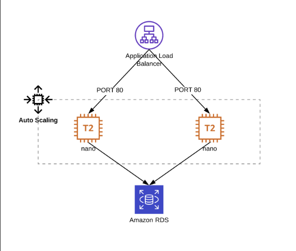

# Infrastructure deployment exercise

Using Terraform, automate the build of the following application in AWS. For the purposes of this challenge, use any Linux based AMI id for the two EC2 instances and simply show how they would be provisioned with the connection details for the RDS cluster.



There are a lot of additional resources to create even in this simple setup, you can use the code we have made available that will create some structure and deploy the networking environment to make it possible to plan/apply the full deployment. Feel free to use and/or modify as much or as little of it as you like.

Document any assumptions or additions you make in the README for the code repository. You may also want to consider and make some notes on:

Q: How would a future application obtain the load balancer’s DNS name if it wanted to use this service?
A:
```
terraform output -raw load_balancer_dns_name
```

Q: What aspects need to be considered to make the code work in a CD pipeline (how does it successfully and safely get into production)?
A: an example of a pipeline is added in `.github/workflows/terraform.yml`.

## Route 53 and Application Load Balancer

The application is publicly exposed through a stable DNS name managed by Route 53 rather than exposing the AWS-generated Application Load Balancer DNS name directly.

Route 53 provides the public DNS name used to access the application. This decouples users and other services from the ALB's generated AWS DNS name. If the ALB is replaced, the Route 53 record can continue to provide the stable application endpoint. TLS is terminated at the ALB using an AWS Certificate Manager certificate.

## Database credentials

RDS is configured with manage_master_user_password = true, allowing AWS to generate and manage the master password using AWS Secrets Manager. The plaintext password must not be stored in Terraform configuration nor committed to the repository.

The EC2 instances receive the RDS endpoint, port, database name and Secrets Manager secret ARN through their bootstrap configuration. An IAM instance role grants the application permission to call secretsmanager:GetSecretValue against the specific RDS secret. The database password is not persisted to the EC2 filesystem.

This approach protects the database credentials and allows for them to be rotated without requiring the credentials to be embedded in the AMI, Terraform source code, or Git repository.

## Terraform and environments

The infrastructure is separated into independent environments to prevent changes in one environment from affecting another. The main environments are:

- Development (dev) — used for development and experimentation.
- Production (prod) — contains the live application infrastructure.

An S3 bucket `cint-code-test-terraform-state` in AWS region `us-east-1` will store the terraform state for each environment, the bucket should be generated before running the pipeline, it is [recommended to enable versioning for the bucket](https://developer.hashicorp.com/terraform/language/backend/s3).

Therefore Terraform should be initialized with the backend configuration for the environment being deployed:

```
terraform init \
  -backend-config=environments/prod/backend.hcl
```

## Required GitHub configuration

The workflow expects these GitHub Environment variables:

```
dev:
  AWS_TERRAFORM_ROLE_ARN

production:
  AWS_TERRAFORM_ROLE_ARN
```